# 纯视觉3D目标检测算法 OPTIMUS

## 1. 开源信息
Apache License 2.0

## 2. 解决思路
### 2.1 任务说明
> **任务概述**: 多视图传感器的3D目标检测算法主要应用于汽车智能驾驶，基于车载多摄像头的输入，完成车辆周围多目标的3D位置检测，并能适应城市工况下的复杂场景。且指标性能接近使用激光雷达的检测水平。  
**功能要求(关键指标)**: NDS > 0.569, mAP > 0.481

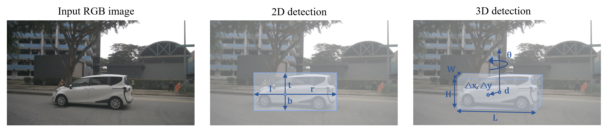

### 2.2 任务解读
基于任务概述和功能要求，得出本任务是在**nuScenes数据集**上，使用**纯视觉(单目或多视图)算法**，进行3D目标检测。

**nuScenes数据集**是一个大规模的多模态数据集，由从6个摄像头，1个激光雷达和5个毫米波雷达收集的数据组成。该数据集有1000个场景，官方分为700/150/150个场景，分别用于训练/验证/测试。每个场景都有20s的视频帧，并且每0.5s用3D边界框进行完整的标注。官方评测指标定义了nuScenes检测分数(NDS)和平均精度(mAP)，以及平均平移误差(mATE)、平均尺度误差(mASE)、平均方向误差(mAOE)、平均速度误差(mAVE)、平均属性误差(mAAE)。

**多视图3D目标检测算法**有基于BEV的方法如BEVDet、M^2BEV，和基于DETR的方法如DETR3D、PETR，以及两者结合的方法如BEVFormer。基于BEV的方法会显式建立一个BEV表示，BEVDet采用LSS方法建立BEV表示，BEVFormer采用Transformer注意力机制生成BEV表示，同时BEVFormer融合了时域信息。但BEVFormer对算力要求太高，而且也有点复杂难懂，我们将其作为基线来对比。我们最终选用的是一种**简单**且**优雅**的算法PETR和其时域扩展版PETRv2。

||**NDS**|**mAP**|**mATE**|**mASE**|**mAOE**|**mAVE**|**mAAE**|
|----|----|----|----|----|----|----|----|
|FCOS3D [[Paper](https://arxiv.org/abs/2104.10956)] [[Code](https://github.com/open-mmlab/mmdetection3d)]|0.428|0.358|0.690|0.249|0.452|1.434|0.124|
|DETR3D [[Paper](https://arxiv.org/abs/2110.06922)] [[Code](https://github.com/wangyueft/detr3d)]|0.479|0.412|0.641|0.255|0.394|0.845|0.133|
|PETR [[Paper](https://arxiv.org/abs/2203.05625)] [[Code](https://github.com/megvii-research/PETR)]|0.504|0.441|0.593|0.249|0.383|0.808|0.132|
|**BEVFormer** [[Paper](https://arxiv.org/abs/2203.17270)] [[Code](https://github.com/fundamentalvision/BEVFormer)]|**0.569**|**0.481**|0.582|0.256|0.375|0.378|0.126|
|PETRv2 [[Paper](https://arxiv.org/abs/2206.01256)] [[Code](https://github.com/megvii-research/PETR)]|0.591|0.508|0543|0.241|0.360|0.367|0.118|

\* 表格中的结果来自相关论文，均为nuScenes测试集上的结果。

### 2.3 任务方案
>- 数据集: nuScenes
>- 算法: FCOS3D-->PETR-->PETRv2
>- 软件框架: MMDetection3D

其中 **PETRv2** 可以达成任务功能要求，所以本任务主要使用PETR的不同配置进行实验。由于测试集上的指标评估需要在nuScenes网站上提交结果才能得到，故本任务只进行验证集指标评估，并对比BEVFormer在验证集上的结果。在验证集上BEVFormer结果是[NDS = 0.517, mAP = 0.416]，本任务实验结果期望在同等条件下能达到或超过这个指标。

MMDetection3D是一个基于Pytorch的3D目标检测工具箱。我们的实验主要在MMDetection3D工具箱上完成。因为是第一次动手实践，所以这也是我们的学习过程的一个记录。我们沿着单目检测FCOS3D-->多视图检测PETR-->时域融合PETRv2，一步步扩展模型，提升精度。

### 2.3 解决思路

## 3. 详细设计
||**FCOS3D**|**PETR**|**PETRv2**|
|----|----|----|----|
|算法框架|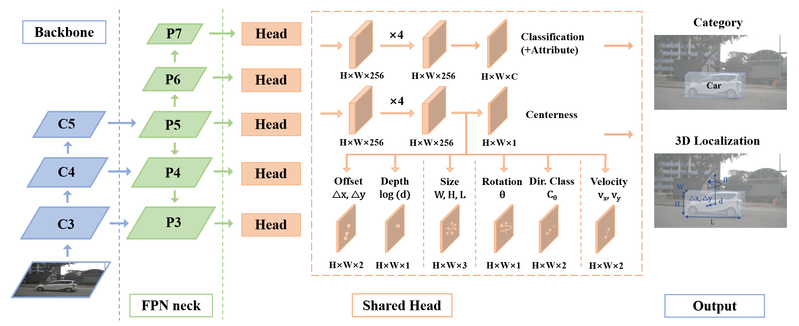|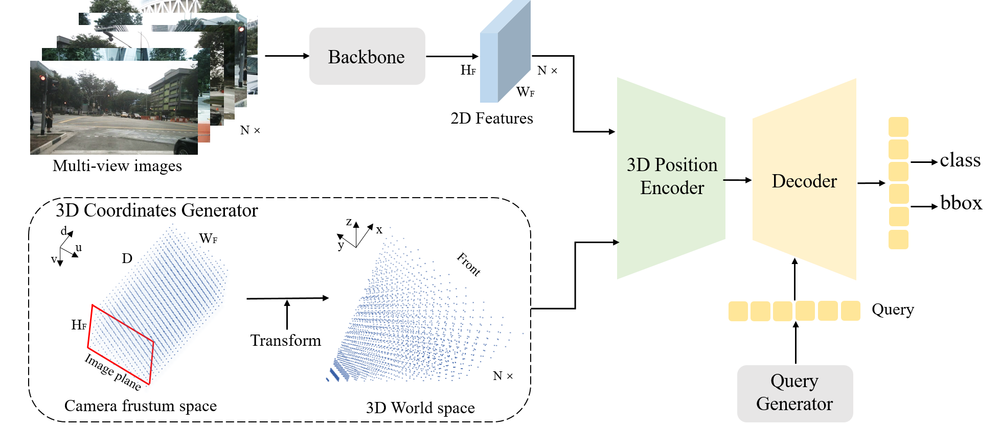|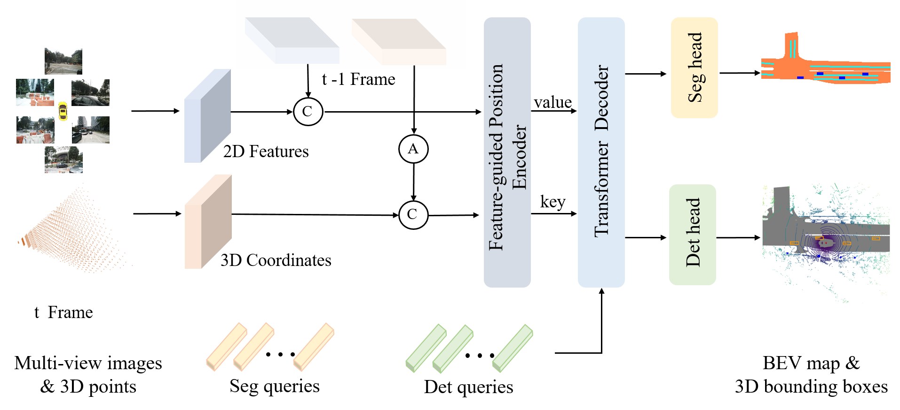|
|输入|单目图像|多视角单目图像|多帧多视角单目图像|
|Backbone|ResNet101|VoVNet99|VoVNet99|
|Neck|FPN_P3-P7|FPN_P4|FPN_P4|
|Head|FCOS|DETR|DETR|
|算法描述|参见[FCOS3D](docs/fcos3d.md)|参见[PETR](docs/petr.md)|参见[PETRv2](docs/petrv2.md)|

### 3.1 FCOS3D

### 3.2 PETR

||**DETR**|**PETR**|
|----|----|----|
|算法框架|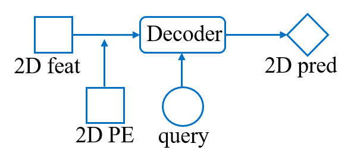|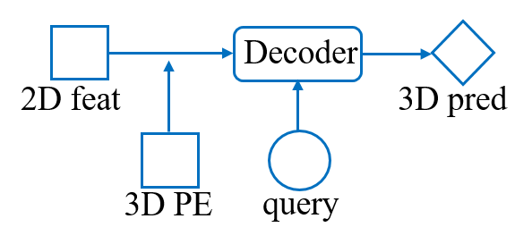|

PETR是一个非常简单的算法，其参考2D目标检测算法DETR。DETR的核心思想是使用基于集合的二分图匹配损失函数和Transformer架构，其优点是不需要先验的锚框或者锚点，也不需要后处理操作（如NMS)。PETR将DETR中的2D PE替换为3D PE，实现了3D目标检测，DETR使用了Transformer编码器和解码器，但是PETR仅使用了Transformer解码器。

> DETR结构
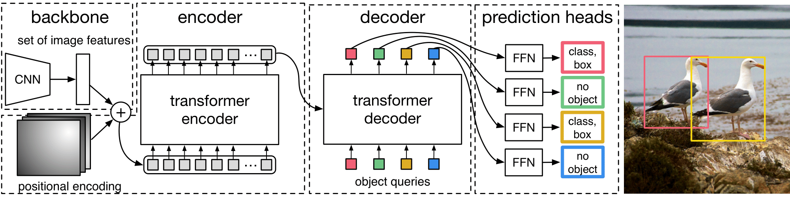
> Transformer结果
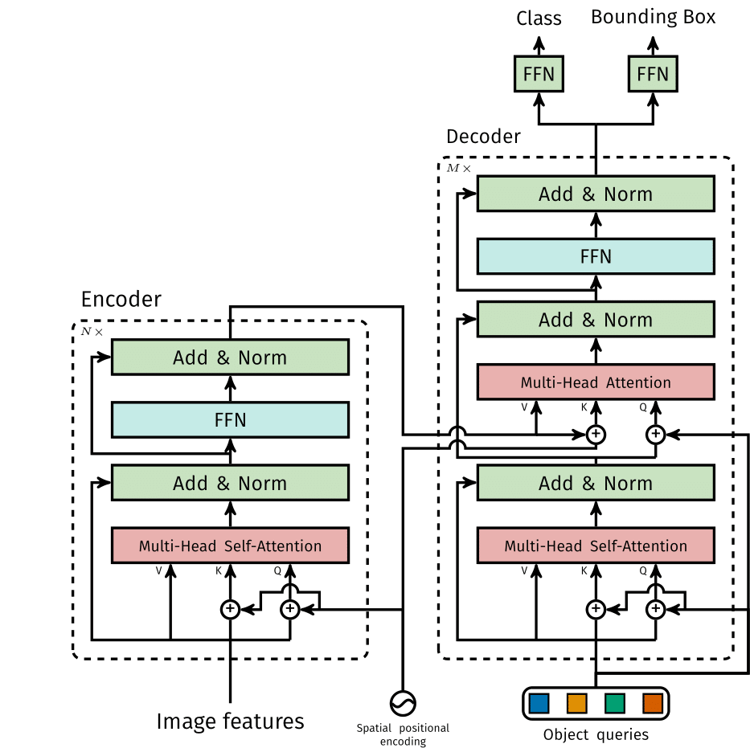

下面是具体算法说明：
#### 整体架构


给定图像 $I=\{ I_i \in R^{3 \times H_I \times W_I}, i=1,2,\dots, N \}$ 来自 $N$ 个视图，图像被输入到骨干网络（例如ResNes50）以提取2D多视图特征 $F^{2d}=\{F^{2d}_i\in  R^{C \times H_F \times W_F}, i=1,2,\dots, N\}$ 。在3D坐标生成器中，相机视锥体空间首先被离散化为3D网格。然后网格的坐标经相机参数变换并生成3D世界空间中的坐标。3D坐标连同2D多视图特征被输入到3D位置编码器，产生3D位置感知特征 $F^{3d}=\{F^{3d}_i\in  R^{C \times H_F \times W_F}, i=1,2,\dots, N\}$ 。3D特征进一步输入到Transformer解码器，并与查询生成器生成的对象查询交互。更新后的对象查询用于预测对象类别以及3D边界框。

#### 3D坐标生成器
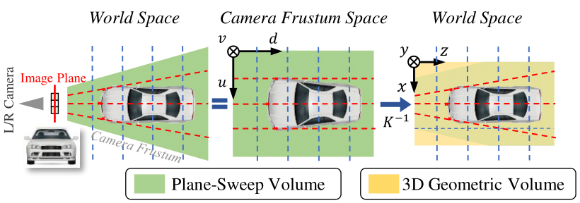

为了建立2D图像和3D空间的关系，我们将相机视锥体空间中的点投影到3D空间，因为这两个空间中的点是一对一的分配。与DGSN类似，我们首先将相机视锥体空间离散化以生成大小为 $(W_F,H_F,D )$ 的网格。网格中的每个点可以表示为 $p^{m}_j = (u_j\times d_j, v_j\times d_j, d_j, 1)^T$ ，其中 $ (u_j, v_j) $ 是图像中的像素坐标， $d_j$ 是沿图像平面正交轴的深度值。由于网格被不同视图共享，因此可以通过反转3D投影来计算3D世界中相应的3D坐标 $p^{3d}_{i,j} = (x_{i,j}, y_{i,j}, z_{i,j}, 1)^T$  

$$p^{3d}_{i,j} = K^{-1}_{i} p^{m}_{j}$$

其中 $K_{i}$ 是建立从3D世界空间到相机视锥体空间变换的第 $i$ 个视图的变换矩阵。所有视图变换后的3D坐标覆盖了场景全景图。我们进一步规范化3D坐标，如下

$$
\left\{
\begin{aligned}
&x_{i,j} = &(x_{i,j}-x_{min}) / &(x_{max}-x_{min})\\
&y_{i,j} = &(y_{i,j}-y_{min}) / &(y_{max}-y_{min})\\
&z_{i,j} = &(z_{i,j}-z_{min}) / &(z_{max}-z_{min})
\end{aligned}
\right.
$$

其中 $[x_{min},y_{min},z_{min},x_{max},y_{max},z_{max}]$ 是3D世界空间感兴趣区域(RoI)。规范化后的 $H_F \times W_F \times D$ 点的坐标最终表达为 $P^{3d}=\{ P^{3d}_i \in R^{(D\times4) \times H_F\times W_F }, i=1,2,\dots, N \}$ 


#### 3D位置编码器
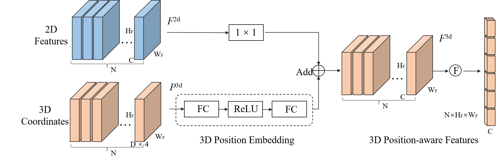

3D位置编码器的目的是通过关联2D图像特征 $F^{2d}=\{F^{2d}_i\in \\R^{C \times H_F \times W_F}, i=1,2,\dots, N\}$ 和3D位置信息获取3D特征 $F^{3d}=\{F^{3d}_i\in  R^{C \times H_F \times W_F}, i=1,2,\dots, N\}$ 。与MetaSR类似，3D位置编码器公式如下：

$$F^{3d}_i = \psi(F^{2d}_i,P^{3d}_i), \quad i=1,2,\dots, N$$

其中 $\psi(.)$ 是位置编码函数。接下来，我们将描述 $\psi(.)$ 的详细实现。给定2D特征 $F^{2d}$ 和3D坐标 $P^{3d}$ ，首先将 $P^{3d}$ 馈入多层感知机(MLP)网络并转换为3D位置嵌入(PE)。然后，2D特征 $F^{2d}$ 通过 $1\times1$ 卷积层进行转换，并与3D PE相加以形成3D位置感知特征。最后，我们将3D感知特征展平作为Transformer解码器的Key组件。

#### 查询生成器和解码器

**查询生成器**：原始DETR直接使用一组可学习的参数作为初始对象查询。参考Deformable DETR，DETR3D根据初始化的对象查询预测参考点。为了缓解3D场景中的收敛困难，类似于Anchor DETR，我们首先在3D时间空间中初始化一组可学习的锚点，在0到1之间均匀分布。然后输入3D锚点的坐标到具有两个线性层的小型MLP网络并生成初始查询对象。在我们的实践中，在3D空间中使用锚点可以保证PETR的收敛，而采用DETR中的设置或在BEV空间中生成锚点无法达到令人满意的检测性能。

**解码器**：对于解码器网络，我们遵循DETR中的标准Transformer解码器，其中包括L个解码器层。在这里，我们将解码器层的交互过程表述为：

$$
\begin{aligned}
Q_l = \Omega_l(F^{3d}, Q_{l-1}), \quad l=1, \dots, L
\end{aligned}
$$

其中， $\Omega_l$ 是解码器的第 $l$ 层。 $Q_{l} \in R^{M\times C}$ 是第 $l$ 层的更新对象查询。 $M$ 和 $C$ 分别是查询和通道的数量。在每个解码器层中，对象查询通过多头注意力和前馈网络与3D位置感知特征交互。在迭代交互之后，更新的对象查询具有高级表示，可用于预测相应的对象。

#### 检测头和损失

检测头主要包括分类和回归两个分支。来自解码器的更新对象查询被输入到检测头并预测对象类别的概率以及3D边界框。请注意，回归分支预测相对于锚点坐标的相对偏移量。为了与DETR3D进行公平对比，我们还采用Focal Loss用于分类，采用L1损失用于3D边界框回归。令 $y = (c,b)$ 和 $\hat{y} = (\hat{c},\hat{b})$ 表示真值和预测值集合，假设 $\sigma$ 是最优分配函数，那么3D目标检测的损失可以概括为：

$$
L(y,\hat{y}) = \lambda_{cls} * L_{cls}(c,\sigma(\hat{c})) + L_{reg}(b,\sigma(\hat{b}))
$$

这里 $L_{cls}$ 表示表示分类的Focal Loss， $L_{reg}$ 是回归的L1损失。 $\lambda_{cls}$ 是平衡不同损失的超参数。

### 3.3 PETRv2

## 整体架构


PETRv2的整体架构建立在PETR之上，并通过时域建模和BEV分割进行了扩展。2D图像特征是使用2D骨干网络（例如ResNet50）从多视图图像中提取的，3D坐标是从相机视锥体空间生成的，如PETR中所述。考虑到ego车辆运动，前一帧 $t-1$ 的3D坐标首先通过姿态变换转换到当前帧 $t$ 的坐标系下。然后，相邻帧的2D特征和3D坐标分别连接在一起并输入到特征引导位置编码器(FPE)。之后使用FPE为Transformer解码器生成Key和Value组件。此外，任务特定的查询，包括检测查询(det queries)和分割查询(seg queries)，从不同空间初始化，被送入Transformer解码器并与多视图图像特征交互。最后更新后的查询被输入到任务特定的检测或分割头中进行最终预测。

## 时域建模
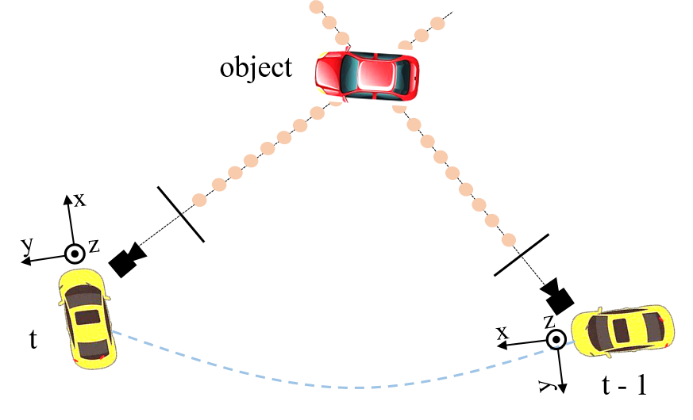

PETR利用图像特征和投影3D点来生成用于多视图3D检测的隐式3D特征。在本节中，我们使用时域建模对其进行扩展，这是通过3D坐标对齐(CA)实现的，以实现更好的定位和速度估计。

**3D坐标对齐** 时域对齐是将帧 $t-1$ 的3D坐标转换到帧 $t$ 的坐标系下。为了清楚起见，我们首先表示一些坐标系：帧 $t$ 的相机坐标系为 $c(t)$ ，激光雷达坐标系为 $l(t)$ ，ego坐标系为 $e(t)$ 。更重要的是全局坐标系 $g$ 。我们将定义 $T^{dst}_{src}$ 为从源坐标系到目的坐标系的变换矩阵。

我们使用 $l(t)$ 作为多视图相机3D位置感知特征生成的默认3D空间。3D点 $P^{l(t)}_i(t)$ 从第 $i$ 个相机投影可以表示为
$$
\begin{split}
    P^{l(t)}_i(t) = T^{l(t)}_{c_i(t)} K^{-1}_{i} P^{m}(t) \\
\end{split}
$$
其中 $P^{m}(t)$ 是在第 $t$ 帧相机视锥体空间的网格中设置的点。 $K_i\in R^{4 \times 4}$ 是第 $i$ 个相机的相机内参矩阵。给定辅助帧 $t-1$ ，我们将3D点的坐标从帧 $t-1$ 对齐到帧 $t$ ：
$$
\begin{split}
    P^{l(t)}_i(t-1) = T^{l(t)}_{l(t-1)} P^{l(t-1)}_i(t-1) 
\end{split}
$$
以全局坐标空间作为帧 $t-1$ 和帧 $t$ 之间的桥梁， $T^{l(t)}_{l(t-1)}$ 可以很容易地计算出来：
$$\begin{split}
        % T^{l(t)}_{l(t-1)} &= T^{l(t)}_{g} {T^{l(t-1)}_{global}}^{-1} \\
        % &= T^{l(t)}_{e(t)} T^{e(t)}_{g} {T^{e(t-1)}_{global}}^{-1} {T^{l(t-1)}_{e(t-1)}}^{-1} \\
        T^{l(t)}_{l(t-1)} &= T^{l(t)}_{e(t)} T^{e(t)}_{g} {T^{e(t-1)}_{g}}^{-1} {T^{l(t-1)}_{e(t-1)}}^{-1} \\
    \end{split}$$
对齐的点的集合 $[P^{l(t)}_i(t-1), P^{l(t)}_i(t)]$ 用于生成3D PE。

## 特征引导位置编码器
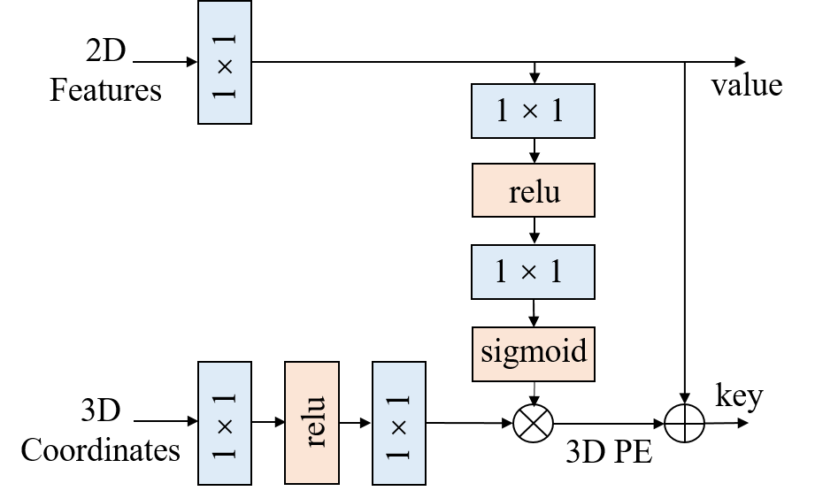

PETR将3D坐标转换为3D位置嵌入(3D PE)。3D位置嵌入的生成可以表示为：
$$
PE^{3d}_i(t) = \psi(P^{l(t)}_i(t))
$$
其中 $\psi(.)$ 是简单的多层感知机(MLP)。PETR中的3D PE与输入图像无关。我们认为3D PE应该由2D特征驱动，因为图像特征可以提供一些信息指导(例如，深度)。在本文中，我们提出一种特征引导的位置编码器，它隐含的引入了先验视觉。特征引导的3D位置嵌入的生成可以表示为：
$$
\begin{split}
PE^{3d}_i(t) &= \xi(F_i(t)) \ast \psi(P^{l(t)}_i(t)) \\
% PE^{3d}_i(t-1) &= \xi(F_i(t-1)) \ast \psi(P^{l(t)}_i(t-1))
\end{split}
$$
其中 $\xi$ 也是一个小型MLP网络。 $F_{i}(t)$ 是第 $i$ 个相机的二维图像特征。通过1x1卷积投影的2D图像特征被送入小型MLP网络和sigmoid函数获得注意力权重。3D坐标由另一个MLP网络 $\psi$ 变换，并与注意力权重相乘以生成3D PE。3D PE加入2D特征，获取Transformer解码器的Key值。投影的2D特征用作Transformer解码器的Value组件。
## 4. 优化说明
## 5. 指标对比
### 5.1 实验环境
我们使用的是一个单卡V100的环境，配置如下：
- Server：10核 CPU 40G 内存 + V100 GPU 32G 显存 + 4T SSD
- OS：Ubuntu Server 18.04 LTS 64位
- CUDA: 10.2
- Pytorch: 1.9.0
- MMDetection3D: 0.17.1

我们总共做了4轮实验：
- [x] 环境配置 12.15
- [x] 数据配置 12.16
- [x] FCOS3D训练、评估 12.16-12.23
- [x] PETR训练、评估 12.28-12.30
- [x] PETRv2训练、评估 12.30-1.6 
- [x] PETRv2_opt训练、评估 1.6-1.12

### 5.2 实验结果
所有实验在Tesla V100单卡环境下在训练集训练，我们在验证集上的评估结果和作为对比的基线结果如下：
||**NDS**|**mAP**|**mATE**|**mASE**|**mAOE**|**mAVE**|**mAAE**|
|----|----|----|----|----|----|----|----|
|FCOS3D [[Config](mmdetection3d/configs/fcos3d/fcos3d_r101_caffe_fpn_gn-head_dcn_2x8_1x_nus-mono3d.py)] [[Model](https://model)] [[Log](https://log)] |0.3629|0.2761|0.8249|0.2653|0.5014|1.3502|0.1601|
|PETR [[Config](projects/configs/petr/petr_vovnet_gridmask_p4_800x320.py)] [[Model](https://model)] [[Log](https://log)] |0.4419|0.3839|0.7462|0.2714|0.4706|0.8049|0.2042|
|PETRv2 [[Config](projects/configs/petrv2/petrv2_vovnet_gridmask_p4_800x320.py)] [[Model](https://model)] [[Log](https://log)] |0.4958|0.4049|0.7452|0.2686|0.4556|0.4094|0.1882|
|PETRv2_opt [[Config](projects/configs/petrv2/petrv2_vovnet_gridmask_p4_800x320.py)] [[Model](https://model)] [[Log](https://log)] |0.5046|0.4122|0.7307|0.2674|0.4016|0.4294|0.1864|
|PETRv2_opt_final [[Config](projects/configs/petrv2/petrv2_vovnet_gridmask_p4_800x320.py)] [[Model](https://model)] [[Log](https://log)] |TODO|||||||
|BEVFormer*|0.517|0.416|0.673|0.274|0.372|0.394|0.198|

\* 表格中的FCOS3D、PETR、PETRv2为我们的实验结果，并提供了训练日志和模型权重文件，BEVFormer数据来自[[论文](https://arxiv.org/abs/2203.17270)]，均为nuScenes测试集上的结果。

我们使用的PETRv2_opt模型[**图片800x320， 2帧融合, NDS = 0.5046, mAP = 0.4122**]在验证集上的指标距离BEVFormer在验证集上的结果[**图片1600x900， 4帧融合, NDS = 0.517, mAP = 0.416**]还有一些差距，还需要进一步优化。

PETRv2还有很多提升空间，后面将训练PETRv2_opt_final模型[**图片1600x640， 多尺度, CBGS数据增强**]，预计会进一步提升精度，但训练时间也将增加几倍。

最后将在训练集和验证集上训练，在**测试集**上评估，其结果将与BEVFormer在测试集上的结果[**NDS = 0.569, mAP = 0.481**]进行对比。
## 6. 指令说明
### 5.1 安装

参考文档 [install](docs/install.md) 进行安装，或使用提供的Docker镜像。

### 5.2 数据

参考文档 [data](docs/data.md) 下载数据，解压到合适的目录下，并进行预处理。部分模型需要预训练模型。

### 5.3 训练

```shell
python tools/train.py ${CONFIG_FILE}
```
训练过程参见 [train](docs/train.md)。

### 5.4 评估

```shell
python tools/test.py ${CONFIG_FILE} ${CHECKPOINT_FILE} --eval bbox
```
评估过程参见 [eval](docs/eval.md)。

### 5.5 可视化

```shell
python tools/test.py ${CONFIG_FILE} ${CHECKPOINT_FILE} --format-only --eval-options 'jsonfile_prefix={RESULT_DIR}'

python tools/visualize.py
```
可视化结果参见 [visualize](docs/visualize.md)。


#### 5.1 FCOS3D
- Backbone

ResNet 101，使用预训练模型。主要作用是特征提取。
```python
backbone=dict(
        type='mmdet.ResNet',
        depth=101,
        num_stages=4,
        out_indices=(0, 1, 2, 3),
        frozen_stages=1,
        norm_cfg=dict(type='BN', requires_grad=False),
        norm_eval=True,
        style='caffe',
        init_cfg=dict(
            type='Pretrained',
            checkpoint='open-mmlab://detectron2/resnet101_caffe'))
```

- Neck

FPN。neck是backbone和head的连接层，主要作用是特征融合，输出多尺度特征。
``` python
neck=dict(
        type='mmdet.FPN',
        in_channels=[256, 512, 1024, 2048],
        out_channels=256,
        start_level=1,
        add_extra_convs='on_output',
        num_outs=5,
        relu_before_extra_convs=True)
```

- Head

FCOS3D Head，包括分类和回归，以及Loss计算。
``` python
bbox_head=dict(
        type='FCOSMono3DHead',
        num_classes=10,
        in_channels=256,
        stacked_convs=2,
        feat_channels=256,
        use_direction_classifier=True,
        diff_rad_by_sin=True,
        pred_attrs=True,
        pred_velo=True,
        dir_offset=0.7854,  # pi/4
        dir_limit_offset=0,
        strides=[8, 16, 32, 64, 128],
        group_reg_dims=(2, 1, 3, 1, 2),  # offset, depth, size, rot, velo
        cls_branch=(256, ),
        reg_branch=(
            (256, ),  # offset
            (256, ),  # depth
            (256, ),  # size
            (256, ),  # rot
            ()  # velo
        ),
        dir_branch=(256, ),
        attr_branch=(256, ),
        loss_cls=dict(
            type='mmdet.FocalLoss',
            use_sigmoid=True,
            gamma=2.0,
            alpha=0.25,
            loss_weight=1.0),
        loss_bbox=dict(
            type='mmdet.SmoothL1Loss', beta=1.0 / 9.0, loss_weight=1.0),
        loss_dir=dict(
            type='mmdet.CrossEntropyLoss', use_sigmoid=False, loss_weight=1.0),
        loss_attr=dict(
            type='mmdet.CrossEntropyLoss', use_sigmoid=False, loss_weight=1.0),
        loss_centerness=dict(
            type='mmdet.CrossEntropyLoss', use_sigmoid=True, loss_weight=1.0),
        bbox_coder=dict(type='FCOS3DBBoxCoder', code_size=9),
        norm_on_bbox=True,
        centerness_on_reg=True,
        center_sampling=True,
        conv_bias=True,
        dcn_on_last_conv=True)
```
- Loss

#### 5.2 PETR
- Backbone

``` python
img_backbone=dict(
        type='VoVNetCP',
        spec_name='V-99-eSE',
        norm_eval=True,
        frozen_stages=-1,
        input_ch=3,
        out_features=('stage4','stage5',))
```
- Neck

``` python
img_neck=dict(
        type='CPFPN',
        in_channels=[768, 1024],
        out_channels=256,
        num_outs=2)
```

- Head

``` python
pts_bbox_head=dict(
        type='PETRHead',
        num_classes=10,
        in_channels=256,
        num_query=900,
        LID=True,
        with_position=True,
        with_multiview=True,
        position_range=[-61.2, -61.2, -10.0, 61.2, 61.2, 10.0],
        normedlinear=False,
        transformer=dict(
            type='PETRTransformer',
            decoder=dict(
                type='PETRTransformerDecoder',
                return_intermediate=True,
                num_layers=6,
                transformerlayers=dict(
                    type='PETRTransformerDecoderLayer',
                    attn_cfgs=[
                        dict(
                            type='MultiheadAttention',
                            embed_dims=256,
                            num_heads=8,
                            dropout=0.1),
                        dict(
                            type='PETRMultiheadAttention',
                            embed_dims=256,
                            num_heads=8,
                            dropout=0.1),
                        ],
                    feedforward_channels=2048,
                    ffn_dropout=0.1,
                    operation_order=('self_attn', 'norm', 'cross_attn', 'norm',
                                     'ffn', 'norm')),
            )),
        bbox_coder=dict(
            type='NMSFreeCoder',
            post_center_range=[-61.2, -61.2, -10.0, 61.2, 61.2, 10.0],
            pc_range=point_cloud_range,
            max_num=300,
            voxel_size=voxel_size,
            num_classes=10), 
        positional_encoding=dict(
            type='SinePositionalEncoding3D', num_feats=128, normalize=True),
        loss_cls=dict(
            type='FocalLoss',
            use_sigmoid=True,
            gamma=2.0,
            alpha=0.25,
            loss_weight=2.0),
        loss_bbox=dict(type='L1Loss', loss_weight=0.25),
        loss_iou=dict(type='GIoULoss', loss_weight=0.0))
```

- Loss

#### 5.3 PETRv2

### 5. 指标对比

#### 5.1 FCOS3D
FCOS第一轮训练结果（V100 单卡运行了7天）在验证集上测试如下：
```
mAP: 0.2761
mATE: 0.8249
mASE: 0.2653
mAOE: 0.5014
mAVE: 1.3502
mAAE: 0.1601
NDS: 0.3629
Eval time: 160.5s

Per-class results:
Object Class    AP      ATE     ASE     AOE     AVE     AAE
car     0.450   0.646   0.151   0.105   2.004   0.121
truck   0.182   0.878   0.203   0.171   1.421   0.180
bus     0.234   1.042   0.192   0.174   2.799   0.306
trailer 0.058   1.107   0.229   0.762   0.676   0.075
construction_vehicle    0.030   1.102   0.456   1.036   0.140   0.275
pedestrian      0.381   0.732   0.288   0.744   0.881   0.166
motorcycle      0.285   0.764   0.267   0.612   1.980   0.141
bicycle 0.228   0.772   0.279   0.772   0.900   0.017
traffic_cone    0.496   0.564   0.315   nan     nan     nan
barrier 0.417   0.641   0.273   0.137   nan     nan
```

#### 5.2 PETR
PETR第一轮训练结果（V100 单卡运行了3天）在验证集上测试如下：

#### 5.3 PETRv2

TODO

### 6. 验证环境

- 服务器：10核CPU 40G内存 + V100 GPU + 4T SSD
- 操作系统：Ubuntu Server 18.04 LTS 64位
- NVIDIA CUDA: 10.2
- Pytorch: 1.9.1
- MMDetection3D: 1.0.0rc6

### 7. 指令说明

#### 7.1 安装

**步骤 0.** 安装 MiniConda [官网](https://docs.conda.io/en/latest/miniconda.html).

**步骤 1.** 使用 conda 新建虚拟环境，并进入该虚拟环境.

```shell
conda create --name openmmlab python=3.8 -y
conda activate openmmlab
```

**步骤 2.** 参考 [PyTorch 官网](https://pytorch.org/) 安装 PyTorch 和 torchvision，例如：

GPU 环境下

```shell
conda install pytorch torchvision -c pytorch
```

**步骤 3.** 参考 [MMDetection3D 文档](https://mmdetection3d.readthedocs.io/) 安装依赖包和 MMDetection3D，例如：

```shell
pip install openmim
mim install mmcv-full
mim install mmdet
mim install mmsegmentation
git clone https://github.com/open-mmlab/mmdetection3d.git
cd mmdetection3d
pip install -e .
```
#### 7.2 数据

**步骤 0.** 下载

在[这里](https://www.nuscenes.org/download)下载 nuScenes 数据集 1.0 版本的完整数据文件。

**步骤 1.** 解压

```shell
tar -xf v1.0-trainval01_blobs.tgz
tar -xf v1.0-test_blobs.tgz
...
```
放到mmdetection3d/data目录下，或者建立软链接，得到如下目录
```
mmdetection3d
├── mmdet3d
├── tools
├── configs
├── data
│   ├── nuscenes
│   │   ├── maps
│   │   ├── samples
│   │   ├── sweeps
│   │   ├── v1.0-test
|   |   ├── v1.0-trainval
```

**步骤 3.** 预处理

通过运行以下指令对 nuScenes 数据进行预处理：

```bash
python tools/create_data.py nuscenes --root-path ./data/nuscenes --out-dir ./data/nuscenes --extra-tag nuscenes
```
处理后的文件夹结构应该如下

```
mmdetection3d
├── mmdet3d
├── tools
├── configs
├── data
│   ├── nuscenes
│   │   ├── maps
│   │   ├── samples
│   │   ├── sweeps
│   │   ├── v1.0-test
|   |   ├── v1.0-trainval
│   │   ├── nuscenes_gt_database
│   │   ├── nuscenes_dbinfos_train.pkl
│   │   ├── nuscenes_infos_train.pkl
│   │   ├── nuscenes_infos_val.pkl
│   │   ├── nuscenes_infos_test.pkl
│   │   ├── nuscenes_infos_train_mono3d.coco.json
│   │   ├── nuscenes_infos_val_mono3d.coco.json
│   │   ├── nuscenes_infos_test_mono3d.coco.json
```

#### 7.3 训练

```shell
python tools/train.py ${CONFIG_FILE} [optional arguments]
```

如果你想在命令中指定工作目录，添加参数 `--work-dir ${YOUR_WORK_DIR}`。

#### 7.4 评估

```shell
python tools/test.py ${CONFIG_FILE} ${CHECKPOINT_FILE} [--out ${RESULT_FILE}] [--eval ${EVAL_METRICS}] [--show] [--show-dir ${SHOW_DIR}]
```

可选参数：

- `RESULT_FILE`：输出结果（pickle 格式）的文件名，如果未指定，结果不会被保存。
- `EVAL_METRICS`：在结果上评测的项，不同的数据集有不同的合法值。具体来说，我们默认对不同的数据集都使用各自的官方度量方法进行评测，所以对 nuScenes 数据集来说在检测任务上可以简单设置为 `mAP`。
- `--show`：如果被指定，检测结果会在静默模式下被保存，用于调试和可视化，但只在单块GPU测试的情况下生效，和 `--show-dir` 搭配使用。
- `--show-dir`：如果被指定，检测结果会被保存在指定文件夹下的 `***_points.obj` 和 `***_pred.obj` 文件中，用于调试和可视化，但只在单块GPU测试的情况下生效，对于这个选项，图形化界面在你的环境中不是必需的。

NuScenes 提出了一个综合指标，即 nuScenes 检测分数（NDS），以评估不同的方法并设置基准测试。
它由平均精度（mAP）、平均平移误差（ATE）、平均尺度误差（ASE）、平均方向误差（AOE）、平均速度误差（AVE）和平均属性误差（AAE）组成。
```
mAP: 0.3197
mATE: 0.7595
mASE: 0.2700
mAOE: 0.4918
mAVE: 1.3307
mAAE: 0.1724
NDS: 0.3905
Eval time: 170.8s

Per-class results:
Object Class    AP      ATE     ASE     AOE     AVE     AAE
car     0.503   0.577   0.152   0.111   2.096   0.136
truck   0.223   0.857   0.224   0.220   1.389   0.179
bus     0.294   0.855   0.204   0.190   2.689   0.283
trailer 0.081   1.094   0.243   0.553   0.742   0.167
construction_vehicle    0.058   1.017   0.450   1.019   0.137   0.341
pedestrian      0.392   0.687   0.284   0.694   0.876   0.158
motorcycle      0.317   0.737   0.265   0.580   2.033   0.104
bicycle 0.308   0.704   0.299   0.892   0.683   0.010
traffic_cone    0.555   0.486   0.309   nan     nan     nan
barrier 0.466   0.581   0.269   0.169   nan     nan
```

#### 7.5 可视化

**步骤 0.** 生成结果文件

```shell
python tools/test.py ${CONFIG_FILE} ${CHECKPOINT_FILE} [--format-only] [--eval-options 'jsonfile_prefix={RESULT_DIR}']
```

**步骤 1.** 使用nuscenes devkit可视化